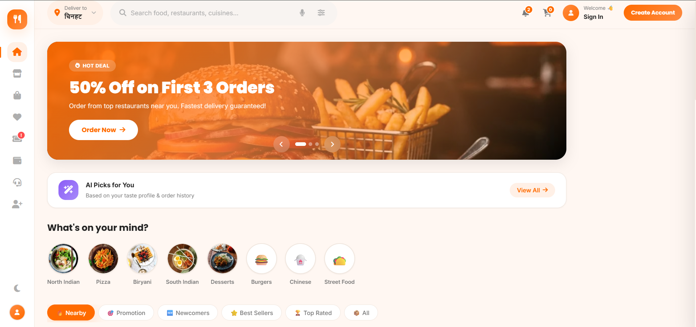
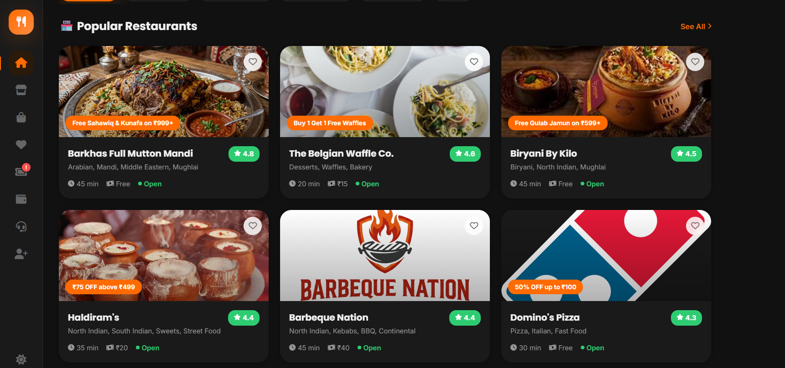
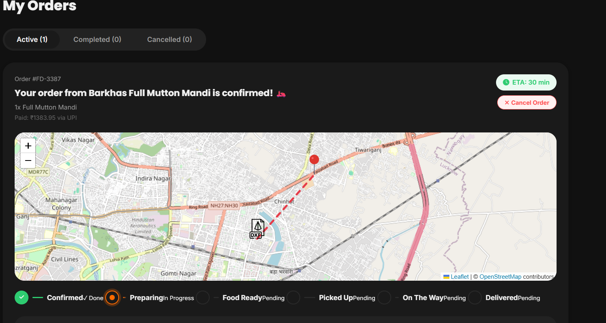

<div align="center">
  

  # 🍔 Foodify — Premium Food Delivery Platform

  **A modern, full-stack MERN food ordering experience.** <br />
  Built for speed, beautiful UI/UX, and real-time tracking.

  [](https://react.dev)
  [](https://vitejs.dev)
  [](https://redux-toolkit.js.org)
  [](https://nodejs.org)
  [](https://mongodb.com)

  [Live Demo](https://foodify-the-resturant-app-1.onrender.com) | [Report Bug](#-issues) | [Request Feature](#-issues)
</div>

---

## 📸 Sneak Peek

### 🏠 Dashboard & Home
*Experience curated recommendations, trending foods, and dynamic offers with a glassmorphic aesthetic.*


### 🍽️ Explore Restaurants
*Filter, search, and discover the best restaurants around you.*


### 🗺️ Real-Time Live Map
*Track your delivery driver in real-time with interactive mapping.*


---

## ✨ Key Features

- **🛍️ Complete E-commerce Flow:** Browse restaurants, add items to cart, checkout, and track orders.
- **🔐 Secure Authentication:** JWT-based auth flow with secure HTTP-only cookies and protected routes.
- **📡 Real-Time Updates (Socket.IO):** Live order status updates and driver location tracking on an interactive map.
- **⚡ Blazing Fast Performance:** Powered by Vite, React 19, and advanced code-splitting (Lazy & Suspense).
- **🎨 Premium UI/UX:** Custom CSS architecture utilizing variables, micro-interactions, smooth gradients, and skeleton loaders.
- **🛒 State Management:** robust global state handling using Redux Toolkit for Cart, Auth, and Wishlist.
- **🗺️ Interactive Maps:** Integrated `react-leaflet` for mapping restaurant locations and delivery routes.
- **📱 Fully Responsive:** Mobile-first design that looks beautiful on any device.

---

## 🛠️ Technology Stack

### Frontend (Client)
- **Framework:** React 19 + Vite
- **State Management:** Redux Toolkit (`@reduxjs/toolkit`) + React-Redux
- **Routing:** React Router v7
- **Maps:** Leaflet & React-Leaflet
- **Styling:** Custom CSS3 with Variables (No heavy frameworks, highly optimized)
- **Icons:** FontAwesome & Lucide React

### Backend (Server)
- **Runtime:** Node.js
- **Framework:** Express.js
- **Database:** MongoDB with Mongoose ODM
- **Real-Time:** Socket.IO
- **Security:** Helmet, CORS, Rate Limiting, bcryptjs, jsonwebtoken

---

## 🚀 Getting Started

### Prerequisites
- Node.js (v18 or higher)
- MongoDB (Local or Atlas cluster)

### Installation

1. **Clone the repository**
   ```bash
   git clone https://github.com/Ujjwal15-coder/Foodify---The-Resturant-App.git
   cd Foodify---The-Resturant-App
   ```

2. **Install all dependencies** (Installs root, client, and server dependencies)
   ```bash
   npm run install:all
   ```

3. **Environment Setup**
   Create a `.env` file in the `server` directory:
   ```env
   NODE_ENV=development
   PORT=5000
   MONGO_URI=your_mongodb_connection_string
   JWT_SECRET=your_super_secret_key
   JWT_EXPIRE=7d
   CLIENT_URL=http://localhost:5173
   ```
   Create a `.env` file in the `client` directory (optional for dev, Vite uses local proxy/fallback):
   ```env
   VITE_API_URL=http://localhost:5000/api
   ```

4. **Seed the Database** (Optional, loads sample restaurants and foods)
   ```bash
   cd server
   node src/seeders/seed.js
   ```

5. **Run the Application** (Starts both frontend and backend concurrently)
   ```bash
   npm start
   ```

   - **Frontend:** `http://localhost:5173`
   - **Backend API:** `http://localhost:5000`

---

## 📂 Project Structure

```text
Foodify/
├── client/                 # React Frontend
│   ├── public/             # Static assets, logos, and images
│   ├── src/
│   │   ├── api/            # Axios interceptors & API config
│   │   ├── components/     # Reusable UI components (Header, Toast, Map, etc.)
│   │   ├── layouts/        # Application layouts (MainLayout)
│   │   ├── pages/          # Route components (Home, Explore, Login, etc.)
│   │   ├── store/          # Redux slices (auth, cart)
│   │   ├── index.css       # Global styles and design system
│   │   └── App.jsx         # App router (Lazy loaded)
│   └── package.json        
├── server/                 # Node.js + Express Backend
│   ├── src/
│   │   ├── controllers/    # Route logic (auth, restaurants, orders, etc.)
│   │   ├── middleware/     # Auth, error handling, rate limiters
│   │   ├── models/         # Mongoose schemas
│   │   ├── routes/         # Express API routes
│   │   ├── seeders/        # DB Population scripts
│   │   └── index.js        # Entry point & Socket.IO setup
│   └── package.json
├── render.yaml             # Render deployment configuration
└── package.json            # Root configuration (concurrently scripts)
```

---

## ☁️ Deployment

This project is configured for easy deployment on **Render**.

1. Connect your GitHub repository to Render.
2. The `render.yaml` file defines two services:
   - **Web Service (API):** Node.js backend.
   - **Static Site (Frontend):** Vite production build.
3. In the Render Dashboard, ensure you set the `MONGO_URI` and `JWT_SECRET` environment variables for the Web Service.
4. Set the `VITE_API_URL` for the Static Site build step to point to your deployed Render API.

---

## 📝 License

Distributed under the MIT License. See `LICENSE` for more information.

---

<div align="center">
  Made with ❤️ for food lovers. <br />
  <i>If you like this project, don't forget to ⭐ star the repository!</i>
</div>
